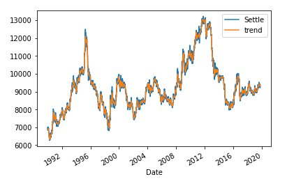
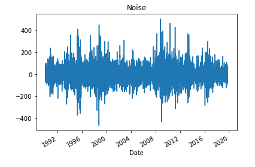
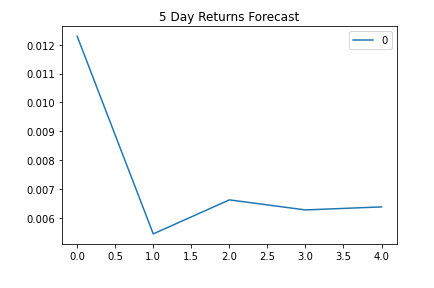
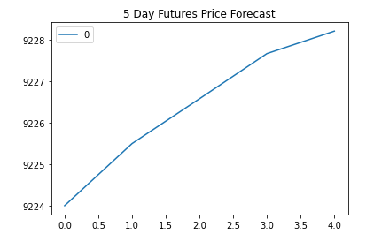
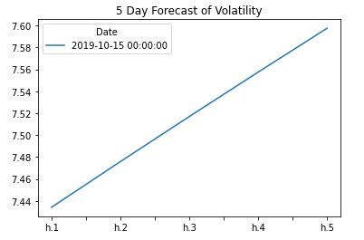
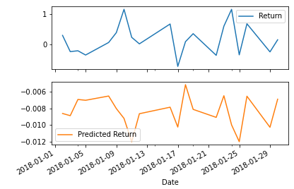

# Time Series Analysis and Linear Regression
Homework Unit 10

### Time Series Forecasting

This is an analysis of the dollar-yen exchange rate futures using time series forecast methods. After formatting the data and trimming it to begin on January 1, 1990, I used the Hodrick_Prescott Filter (HP Filter) to decompose the futures settle price into its trend and noise components. Below is a graph of the settle price against the trend line:

Although the trend line seems similar to the settle price line, the graph below which shows the noise component, shows how much of the actual noise was removed.

Next, I used an ARMA model from the statsmodel libary to forecast returns. For this model, I used an order of 2,1. The forecast for the next 5 days of returns are shown in the plot below. It shows that the ARMA model predicts lower returns in the next 5 days. 

Then I used an ARIMA model with order 5,1,1 to forecast settle prices. This forecast shows that the raw settle price for yenfutures will increase in the next 5 days. 

Lastly, I forecasted volatility of yenfutures using GARCH with order 2,1. The plot predicts the 5 day volatility  to increase. 

#### Conclusions on Time Series Forecasting
Based on the above, I would not buy the yen at the moment. Not because I think I would lose money but more because all 3 models did not seem to be a good forecasting models. The P values were very high and the AIC and BIC values were high. It seems like the results are inconclusive and I would not be confident in using these models to trade yen futures. What I can probably do to improve the model's fit is to change the autoregression and lag values (p and q) to see whether I get better fitting models.

### Regression Analysis

In this section, I built an SKLearn linear regression model to predict yen futures returns using lagged returns. To get the return, I used the `pct_change` function, and to get the 1 day lagged return, I used the `shift` function.

For this analysis, we used 2018-2019 daily settle price data for testing, and the rest of the data before that period for training. The next step was to create a linear regression model and fit it into the training data.  Using this model, I predicted the returns and compared the prediction against the actual values of 2018-2019.Below is a plot of the first 20 predicted returns agains the actual returns.

To look at the performance of my predictions, I calculated the Root Mean Squared Error (RMSE) for both the In sample data (x train and y train) and out of sample data (X test and y test). 

| Sample | RMSE |
| ------ | ----------- |
| In Sample   | 0.59 |
| Out of Sample | 0.41 |

From these RMSE results, we can say that the model is a bit underfitted (Out of Sample RMSE < In sample RMSE). Even though an out of sample RMSE of 0.41 is not terribly bad and performed better than in sample data, We can try to improve the fit by adding more training data to see if we can get the RMSE of both in sample and out of sample data closer. 
